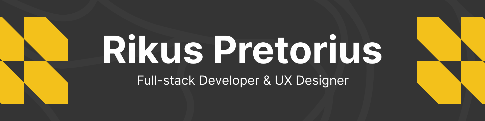

<!-- Banner & Header -->

	
	 
	
  

	
	 
	

# 👋 Hi, I'm Rikus Pretorius
**Full Stack Developer & UX Designer**  
Double Major in Interactive Development & User Experience Design  
Open Window Institute

	
	

---

## 🧑‍💻 About Me

Creative technologist passionate about building accessible, responsive, and user-focused web applications. I combine technical expertise with a strong design sense to deliver seamless digital experiences.

---

## 🛠️ Skills & Tech Stack

- **Frontend:** React.js, HTML5, CSS3, JavaScript (ES6+)
- **Backend:** Node.js, MySQL, MongoDB
- **Design/UX:** Figma, Affinity, User Research, Wireframing, Prototyping

---

## 📁 DV200 Major Projects

| Project | Description | Link |
| ------- | ----------- | ---- |
| **Gamestat** | Responsive web app for event management. | [GitHub Repo](https://github.com/wrapperik/formative-one-gamestat.git) |
| **Billionaires** | Interactive portfolio showcasing design and dev skills. | [GitHub Repo](https://github.com/victordupreez0/Code_Blooded_DV200_S1SA2_Ecommerce_App.git) |
| **Unmute** | E-commerce platform with custom UX flows. | [GitHub Repo] (https://github.com/wrapperik/unMute_RikusPretorius_241044.git) |

---

## 🌱 Other Projects

	
Click to expand

- **Personal Blog** – Minimalist blog built with React and Markdown. [GitHub](https://github.com/wrapperik/personal-blog)
- **Weather Dashboard** – Real-time weather app using OpenWeatherMap API. [GitHub](https://github.com/wrapperik/weather-dashboard)
- **Task Tracker** – Simple productivity tool for daily tasks. [GitHub](https://github.com/wrapperik/task-tracker)

---

## 📊 GitHub Stats

	
	
	 
	

---

## 📫 Contact

- Email: [rikush60@gmail.com](mailto:rikush60@gmail.com)
- LinkedIn: [linkedin.com/in/rikus-pretorius](https://linkedin.com/in/rikus-pretorius)

---

	⭐ Thanks for visiting my profile! Feel free to explore my projects and connect with me.

